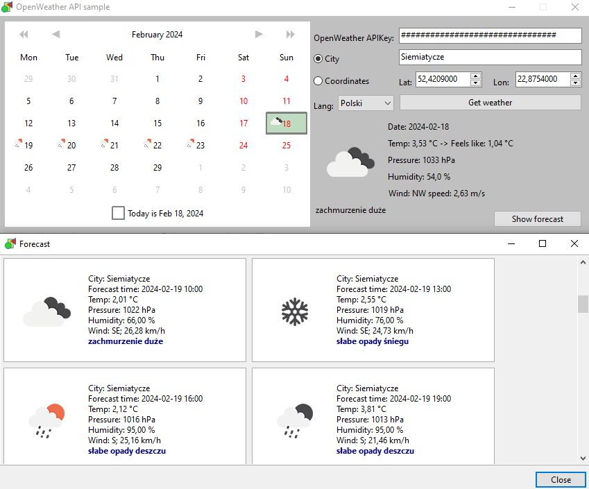

# OpenWeather API

Get the current weather and the forecast from `OpenWeather` API.
You can get a free api key at: https://home.openweathermap.org/users/sign_up

To compile the example, you need the CalLite component - you can install using `OnlinePackageManager` or download from https://sourceforge.net/p/lazarus-ccr/svn/HEAD/tree/components/callite/ and install manually.

